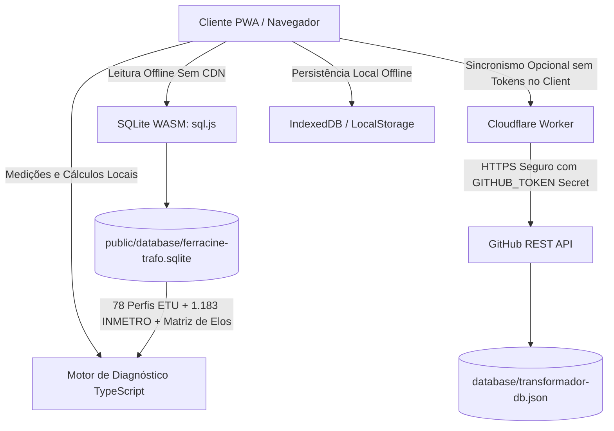

# Estado do Projeto: Ferracine Diag Trafo

**Data da Última Atualização:** 08/09/2026  
**Responsável Técnico:** Elias Bruno Silva (`Bruno1991`)  
**Branch Ativa:** `main`  
**Status Geral:** ✅ Produção / Estável / 100% Funcional no GitHub Pages & Cloudflare Workers  
**Repositório GitHub:** `https://github.com/Bruno1991/Ferracine_Diag_Trafo`  
**Worker de Sincronização:** `https://ferracine-diag-trafo-sync.contato-elias-inbox.workers.dev`  
**URL de Produção (Pages):** `https://bruno1991.github.io/Ferracine_Diag_Trafo/`  

---

## 1. Visão Geral e Propósito do Sistema

O **Ferracine Diag Trafo** é um sistema PWA / Web offline-first voltado para engenheiros e eletricistas realizarem diagnósticos de campo, auditorias elétricas e relatórios de conformidade técnica em transformadores de distribuição aéreos e terrestres.

### Capacidades Centrais:
- **Banco de Dados Técnico Integrado:**
  - **78 Perfis Normativos Energisa ETU:** Curvas de referência técnica para transformadores monofásicos e trifásicos conforme ETU 109.1 v5.0 (07/2026), ETU 109.2, NDU 001, NDU 002 e PRODIST Módulo 8.
  - **1.183 Modelos Homologados INMETRO / PBE:** Fabricantes reais (WEG, Romagnole, ITEL, Trafo, Toshiba, etc.) com potências, perdas $P_0$ e $P_k$, impedância %Z e rendimentos de fábrica.
  - **Placas de Campo / Técnicos:** Cadastro dinâmico de novas placas encontradas em campo, persistidas localmente e sincronizadas de forma bidirecional.
- **Ciclo de Medições Temporizadas:**
  - Suporte a ciclos de 5 segundos, 5 minutos ou 10 minutos (3 etapas temporizadas).
  - Análise de tensões F-F, F-N, correntes $I_a, I_b, I_c, I_n$, desbalanço de corrente, fator de potência e carregamento kVA.
  - Cálculo de FDTP (%) e conformidade de tensão segundo PRODIST (Adequada, Precária, Crítica).
- **Dimensionamento & Recomendações Automáticas:**
  - Seleção do elo fusível ideal conforme tabelas da ETU (ex: elos K para mineral/vegetal).
  - Recomendação inteligente de TAP com bloqueio de segurança em caso de inconsistência de medições.
- **Diagrama Fasorial Hexagonal & Curvas:**
  - Renderização vetorial dos fasores de tensão e corrente e verificação de rotação de fase.
- **Emissão de Laudos em PDF e Planilhas Excel:**
  - Relatório técnico pronto para assinatura, com fotos comprobatórias com carimbo de dados e sem repetições redundantes.

---

## 2. Entregas e Conquistas Realizadas na Sessão

### 2.1. Conformidade e Limpeza de Assinaturas nos Laudos Técnicos (PDF & Fotos)
- **Problema:** Assinaturas e nomes de responsáveis técnicos estavam sendo duplicados repetidamente no final do PDF e sobrepostos em rodapés das fotos do relatório.
- **Solução:**
  - Removidas as assinaturas redundantes do rodapé das fotos anexas e do encerramento do laudo.
  - As assinaturas, nomes e registros profissionais (CREA/CFT) ficaram centralizados exclusivamente na **Seção 1 (Dados Iniciais e Identificação) da Página 1**, garantindo apresentação visual limpa e profissional.

### 2.2. Captura Automática de Data e Hora
- **Solução:** Integrada a obtenção automática da data e horário atuais diretamente pelo hardware do dispositivo móvel/desktop com fallback de rede no momento da inicialização do diagnóstico, evitando preenchimentos manuais ou datas defasadas.

### 2.3. Simplificação da Aba de Configurações
- **Solução:** A aba de configurações foi simplificada para conter um botão único e claro: **"Sincronizar Agora"**, eliminando poluição visual e parâmetros que causavam confusão operacional.

### 2.4. Infraestrutura de Sincronização Segura com Cloudflare Worker
- **Problema:** O sincronismo direto com o GitHub pelo frontend exigia expor um Personal Access Token no navegador do cliente, o que representava risco de vazamento de credenciais.
- **Solução Implementada:**
  - Criado e implantado em produção o Cloudflare Worker:
    `ferracine-diag-trafo-sync.contato-elias-inbox.workers.dev`
  - Código-fonte versionado em `cloudflare-worker/src/index.ts` e `wrangler.toml`.
  - O segredo `GITHUB_TOKEN` foi gravado de forma criptografada nos servidores da Cloudflare (`wrangler secret put GITHUB_TOKEN`).
  - As rotas `GET /api/sync` e `POST /api/sync` atuam como proxy seguro com a API do GitHub (`database/transformador-db.json`), validando payloads com CORS restrito.
  - O frontend agora se conecta prioritariamente ao Worker sem precisar de token no navegador.
  - Rotação do `FULL_ACESS_TOKEN` e geração de token fine-grained específico para o projeto em `C:\dev\.env`.

### 2.5. Correção do Catálogo de Placas e Integração INMETRO no Seletor
- **Problema Inicial:** O campo *"Carregar dados de uma placa já cadastrada"* exibia apenas 26 perfis genéricos, sem carregar os 1.183 modelos INMETRO do banco SQLite nem diferenciar corretamente as placas de campo.
- **Bug Identificado e Corrigido:**
  - Os 78 perfis normativos da ETU começam com `ETU109...` (sem hífen após ETU). A verificação com `ETU-` fazia com que todos os 78 modelos caíssem na categoria de *"Placas de Campo"*, fazendo o grupo ETU desaparecer (`0 itens`).
- **Solução Final (Commit `72fe262`):**
  - Implementada a separação canônica utilizando `isCommunityTransformer`:
    - **⚡ Perfis Normativos Energisa ETU (78):** Exibe com fidelidade os 78 modelos oficiais da ETU com `%Z` e rendimento $\eta$.
    - **🏛️ Modelos Homologados INMETRO / PBE (1.183):** Carrega todos os 1.183 transformadores oficiais de fábrica com auto-preenchimento instantâneo de fabricante, modelo, kVA, tensões primárias/secundárias, perdas e rendimento.
    - **📋 Placas de Campo / Técnicos:** Espaço reservado exclusivamente para placas cadastradas pelos usuários em campo.
  - Adicionada barra de **busca em tempo real** (filtro por fabricante, modelo ou potência kVA) e **seletor de categoria** (Todas as Fontes, ETU, Campo, INMETRO).

### 2.6. Ajustes no PDF e Suporte à Medição Instantânea
- **Ajuste Seções 1 e 2 no Laudo:** TAG do trafo movida do cabeçalho da Seção 1 para o bloco de especificações da Seção 2 com o título *"2. DADOS E ESPECIFICAÇÕES NOMINAIS DO TRANSFORMADOR"*.
- **Medição Instantânea (10 min pós-fechamento):** Validada a operação com medição única sem bloqueio indevido de laudo ou TAP.
- A tolerância fasorial e de tensões PRODIST foi desacoplada de bloqueios críticos, permitindo recomendação de TAP assertiva em cenários reais de baixa tensão (ex: 206,3 V).

### 2.7. Auditoria dos Cálculos de Carregamento e Alinhamento Normativo (NBR 5356-7, NDU 006 / NDU 007)
- **Problema Crítico de Campo Identificado:** Em ocorrências reais (ex: Trafo PTCA0121 de 112.5 kVA, onde a Fase C operava a 425 A enquanto a nominal é 295.2 A), o app calculava apenas a média aritmética trifásica global (81.5%) e rotulava o transformador como "IDEAL", mascarando a queima iminente por sobrecarga térmica na Fase C (144.0%). Adicionalmente, o desbalanço de corrente de campo era tratado como "INCONSISTENTE", bloqueando o TAP.
- **Solução de Engenharia Implementada (Commit `3b81b43`):**
  - **Cálculo de Carregamento por Fase:** Agora calcula individualmente $I_a/I_{nom}$, $I_b/I_{nom}$ e $I_c/I_{nom}$, identificando a `criticalPhase` e `maxPhaseLoadingPercent`.
  - **Condição Diagnóstica Térmica:** O enquadramento térmico passa a ser governado pelo ponto mais quente da fase crítica conforme NBR 5356-7 e IEEE Std C57.91 ($>120\%$ = `SOBRECARGA_CRITICA`, $100\%\text{ a }120\%$ = `SOBRECARGA_MODERADA`, $85\%\text{ a }100\%$ = `ELEVADO`, $45\%\text{ a }85\%$ = `IDEAL`, $<45\%$ = `SUB-CARREGADO`).
  - **Cálculo Físico de Perdas Joule:** Perdas no cobre ($P_{cu}$) sob regime desbalanceado agora utilizam a média quadrática das correntes de fase $(I_a^2 + I_b^2 + I_c^2) / (3 I_{nom}^2) \cdot P_{k,75} \cdot K_t$.
  - **Desbloqueio de TAP:** O desbalanceamento de corrente de campo passa a ser tratado como alerta operacional de rede (NDU 006 / NDU 007) e não mais como erro de medição do eletricista, liberando o cálculo assertivo de comutação de TAP.
  - **Parecer Operacional e Relatórios:** Laudo PDF, tela de diagnóstico e planilha Excel agora trazem alertas explícitos de remanejamento e balanceamento de ramais na BT da fase crítica para evitar reincidência de queima do elo fusível primário.

### 2.8. Higienização Arquitetural e Limpeza de Código Obsoleto (07/09/2026)
- **Eliminação de Código Morto:**
  - Removidos definitivamente os arquivos legados órfãos `src/data/normativeBase.ts` e `src/data/transformerDatabase.ts` (100% substituídos pelo SQLite relacional `ferracine-trafo.sqlite`).
- **Remoção de Cálculos Desacoplados do Escopo de Campo:**
  - **Algoritmo de Comutação de TAP:** Removidas as funções e propriedades de recomendação de TAP no diagnóstico, focando o relatório nas reais necessidades periciais de campo.
  - **Cálculo de Perdas Joule Operacionais e Eficiência:** Removidos do diagnóstico e relatórios, eliminando fórmulas conceituais desnecessárias para a auditoria de sobrecarga.
  - **Fórmulas Empíricas Exponenciais:** Removida a função `computeNominalLossesAndEfficiency` ($5.5 \cdot S^{0.85}$, etc.), mantendo a integridade dos dados reais de fábrica do SQLite.
  - **Ângulos e NEMA Inoperantes:** Removidas variáveis sem formulário de entrada (`angleA, angleB, angleC`, `phaseAngleTheta`), o alerta inoperante `ERRO_ANGULO_TRIFASICO`, o desbalanceamento NEMA (`voltageUnbalancePercentNema`) e a coleção órfã `phaseAlerts`.
- **Eliminação de Redundâncias:**
  - `DiagnosticSummary.tsx` e `pdfGenerator.ts` agora consomem diretamente `analysis.currentUnbalancePercent`.
- **Foco Estrito do Sistema:**
  - Diagnóstico conciso e robusto: 1) Status de carregamento térmico do trafo (% e condição NBR 5356-7); 2) Identificação das fases de maior e menor carregamento e fase crítica; 3) Médias elétricas e potências; 4) Conformidade de tensão e FDTP (PRODIST Módulo 8); 5) Elo fusível primário adequado (ETU-109 Tabela 16); 6) Simulação pericial de balanceamento secundário (NDU 006 / NDU 007).

### 2.9. Modularização Completa dos Módulos Monolíticos (07/09/2026)
- **Extração de Imagens de Fórmulas:**
  - Excluído o monolítico `src/utils/formulaImages.ts` (387 KB de Base64 embutido).
  - Criado `src/utils/formulaAssets.ts`, carregando os arquivos PNG sob demanda a partir de `public/formulas/` com cache em memória e suporte híbrido Navegador/Node.js (`/* @vite-ignore */`).
- **Modularização do Gerador de Laudos PDF (`src/utils/pdfGenerator.ts` -> `src/utils/pdf/`):**
  - Dividido em módulos coesos e especializados:
    - `types.ts`: Definições de tipagem, paleta de cores institucional e `formatKv`.
    - `pdfHeader.ts`: Renderização do cabeçalho oficial, logo Energisa vetorial e rodapé global com numeração dinâmica.
    - `pdfTables.ts`: Tabelas executivas (`autoTable`) de avaliação PRODIST/NDU e medições temporizadas.
    - `pdfSections.ts`: Páginas 1, 2, 3 (diagrama fasorial hexagonal em A4 paisagem) e 4 (normativa e fórmulas recortadas).
    - `pdfPhotos.ts`: Anexo fotográfico de campo com enquadramento proporcional (1 foto por página, até 15 fotos).
    - `index.ts`: Orquestrador assíncrono de compilação do documento PDF.
  - `src/utils/pdfGenerator.ts` transformado em fachada re-exportadora retrocompatível.
- **Modularização da Camada de Banco de Dados (`src/utils/sqliteAndSplitLoader.ts` -> `src/utils/database/`):**
  - Dividido em módulos especializados:
    - `types.ts`: Interfaces de esquemas, faixas PRODIST nominais e constantes.
    - `sqliteRuntime.ts`: Inicialização WebAssembly (`sql.js`), persistência IndexedDB e URLs locais de assets.
    - `sqliteMappers.ts`: Conversores de tipos, mapeamento de tabelas (`transformers`, `inmetro_models`, `fuse_recommendations`) e validação de integridade.
    - `sqliteQueries.ts`: Consultas em memória, classificação PRODIST Módulo 8 e busca assertiva de elo fusível da Tabela 16.
    - `index.ts`: Ponto de entrada do módulo.
  - `src/utils/sqliteAndSplitLoader.ts` reduzido a uma fachada retrocompatível.
- **Modularização do Componente de Medições Temporizadas (`TimedMeasurements.tsx`):**
  - Reduzido de 869 linhas para 318 linhas de orquestração limpa.
  - Extraídos os subcomponentes:
    - `MeasurementTimerControls.tsx`: Seletores de quantidade de medições (1, 2 ou 3) e modo de intervalo (1s, 5m, 10m).
    - `MeasurementStageCard.tsx`: Cartão individual de cada medição com suporte aos dois estados (display digital do cronômetro com bloqueio de tela vs. campos de entrada de tensão F-N, F-F, correntes e validação).

### 2.10. Migração para Fórmulas Matemáticas Vetoriais em SVG (07/09/2026)
- **Eliminação Completa de Imagens PNG:**
  - Excluídos todos os arquivos estáticos de imagem em `public/formulas/` e `public/formula_in_trifasico.png`.
- **Implementação do Módulo de Fórmulas SVG (`src/utils/formulaSvgs.ts`):**
  - Fórmulas matemáticas vetoriais com resolução infinita (estilo LaTeX / IEEE / ABNT):
    - $I_N$ trifásica ($S_{\text{nom}} / (\sqrt{3} \times V_{\text{sec}})$ — NDU 006);
    - $I_N$ monofásica ($S_{\text{nom}} / V_{\text{sec}}$ — NDU 007);
    - Potência aparente trifásica e carregamento de pico ($S = \sqrt{3} V I$, $\%$ Pico);
    - FDTP $\%$ e equação de $\beta$ (PRODIST Módulo 8);
    - Desbalanço de carga BT ($15\%$ NDU 006 / 007).
  - Suporte a tema escuro/claro nativo via `currentColor`.
  - Conversor de alta densidade (300 DPI) para o Laudo PDF via Canvas offscreen.
- **Componente Vetorial React (`src/components/FormulaSvg.tsx`) e Proporções Compactas:**
  - Renderiza as fórmulas diretamente como SVG responsivo em `NormsAndCalculationsView.tsx`, com nitidez perfeita em qualquer zoom de tela.
  - Otimização das dimensões e ViewBoxes para formato compacto e equilibrado, eliminando cortes de borda e redimensionamento excessivo tanto na tela (Web UI) quanto no Laudo Pericial em PDF.

### 2.11. Eliminação de Sugestões e Dicas, Foco em Dados Reais e Espaçamento no Laudo (08/09/2026)
- **Eliminação de Dicas, Sugestões e Simulação de Balanceamento:**
  - Removidos completamente do app e do PDF qualquer palpite ou sugestão de intervenção operacional (ex: *"Recomenda-se remanejamento de carga..."*, *"⚠ ATENÇÃO PERICIAL: Mesmo realizando o balanceamento..."*, *"SE FIZER BALANCEAMENTO DE FASES... CONTINUARÁ SOBRECARREGADO"* e *"Parecer de Remanejamento"*).
  - O sistema passa a apresentar exclusivamente os **resultados objetivos e quantitativos** dos dados inseridos pelo usuário (carregamento por fase, limites normativos PRODIST, elo de proteção ETU e fases anômalas).
- **Flexibilidade em Autores do Laudo:**
  - Seção padronizada como *"AUTORES DO LAUDO (ELETRICISTA / TÉCNICO)"*, com botão *"ADICIONAR ELETRICISTA / TÉCNICO"* e opções `ELETRICISTA`, `TÉCNICO`, `ENGENHEIRO` e `RESPONSÁVEL`.
- **Afastamento Visual no Laudo PDF (Página 4):**
  - Adicionado espaçamento vertical generoso (+14 mm) entre a Seção 3 (*FÓRMULAS MATEMÁTICAS*) e a Seção 4 (*PARECER E OBSERVAÇÕES DE CAMPO*), eliminando proximidade excessiva e melhorando a diagramação pericial.

---

## 3. Arquitetura Técnica e Stack de Tecnologias

### Detalhamento das Camadas:
| Componente | Tecnologia | Papel |
| :--- | :--- | :--- |
| **Frontend** | React 19 + TypeScript + Vite | Interface responsiva, temas Claro/Escuro, acessibilidade. |
| **Engine Elétrica** | TypeScript puro (`src/utils/electricalCalculations.ts`) | Fórmulas PRODIST Módulo 8, NDU 006, NBR 5356-7 e ETU-109. |
| **Módulo PDF** | `src/utils/pdf/` (`jspdf` + `jspdf-autotable`) | Geração modular do laudo técnico pericial de 5 páginas. |
| **Banco Offline** | SQLite 3 via WebAssembly (`src/utils/database/`) | Banco relacional `public/database/ferracine-trafo.sqlite` carregado localmente sem dependência de internet. |
| **PWA / Cache** | Service Worker nativo | Cache de assets estáticos, WASM e binário SQLite para funcionamento 100% offline. |
| **Proxy Seguro** | Cloudflare Workers (`cloudflare-worker/`) | Intermediação das chamadas à API do GitHub protegendo tokens. |
| **CI/CD** | GitHub Actions (`deploy-pages.yml`) | Validação estrita de tipos, testes automatizados e deploy contínuo no GitHub Pages. |

---

## 4. Estado das Validações e Testes

Todas as validações automáticas foram executadas localmente com **100% de aprovação**:

- **Checagem de Tipos TypeScript:**
  - Comando: `npx tsc --noEmit`
  - Resultado: **0 erros** (concluído com código 0).
- **Testes Unitários e Normativos de Diagnóstico:**
  - Comando: `npm test` (`scripts/verify-diagnostic.ts`)
  - Resultado: **100% aprovado**.
  - Validações: 1.183 modelos INMETRO (613 novos, 570 recondicionados), FDTP 6,16%, elo 12K, alertas PRODIST.
- **Teste de Geração de Laudo PDF:**
  - Comando: `npx tsx scripts/generate-test-pdf.ts` e `python scripts/verify-pdf.py dist/test-laudo.pdf`
  - Resultado: **100% aprovado** (5 páginas completas, sem distorção, sem tabelas órfãs).
- **Build de Produção:**
  - Comando: `npm run build`
  - Resultado: **Sucesso** em ~11s via Vite sem qualquer advertência externa.
- **GitHub Actions (GitHub Pages Deploy):**
  - Último Run: `33954442929` (Commit `72fe262`)
  - Status: **Success** (Build: 29s, Deploy: 11s).
  - Deploy em Produção: **Ativo e atualizado**.

---

## 5. Mapeamento de Segredos e Variáveis de Ambiente

As credenciais do operador estão devidamente resguardadas em `C:\dev\.env` (nunca versionadas no Git):
- `ferracine_diag_trafo_token_db`: Token Fine-Grained com permissões restritas de leitura/escrita no repositório `Ferracine_Diag_Trafo`.
- `GITHUB_TOKEN` (no Cloudflare): Segredo encriptado configurado via `wrangler secret put GITHUB_TOKEN` dentro do Worker `ferracine-diag-trafo-sync`.
- `FULL_ACESS_TOKEN`: Token de administração mantido fora do código do aplicativo.

---

## 6. Próximos Passos / Roteiro para Amanhã

Quando retomarmos os trabalhos amanhã, os seguintes itens estão organizados para continuidade:

1. **Testes em Campo com Dispositivos Móveis:**
   - Realizar teste prático de usabilidade do PWA em smartphone/tablet em modo avião (offline completo).
   - Validar a seleção de placas do INMETRO e ETU em telas menores com o novo seletor responsivo.
2. **Exportação de Relatórios:**
   - Conferir se o usuário deseja algum ajuste visual fino adicional no cabeçalho ou nas tabelas do laudo gerado em PDF.
3. **Backup e Sincronismo de Placas de Campo:**
   - Testar o envio de uma placa de campo real recém-criada através do botão *"Sincronizar Agora"* e verificar a atualização automática em `database/transformador-db.json`.
4. **Novas Funcionalidades Desejadas pelo Usuário:**
   - Levantar quaisquer novas demandas para o aplicativo ou outros projetos da pasta `C:\dev`.

---

> **Nota para o Agente:** Este documento é o ponto de partida canônico para retomar as atividades no repositório `C:\dev\Ferracine_Diag_Trafo`. Todo o ambiente local encontra-se limpo, sem branches pendentes e com a branch `main` sincronizada com a nuvem.
