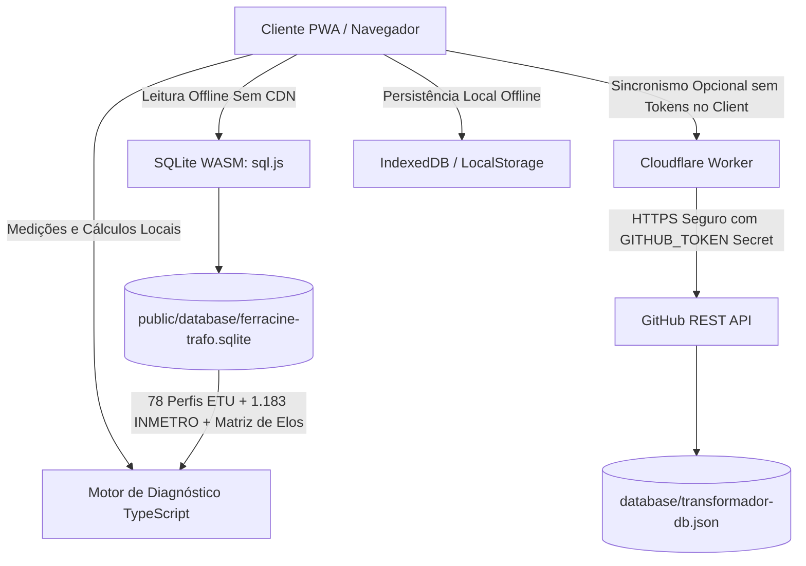

# Estado do Projeto: Ferracine Diag Trafo

**Data da Última Atualização:** 05/09/2026  
**Responsável Técnico:** Elias Bruno Silva (`Bruno1991`)  
**Branch Ativa:** `main`  
**Status Geral:** ✅ Produção / Estável / 100% Funcional no GitHub Pages & Cloudflare Workers  
**Repositório GitHub:** `https://github.com/Bruno1991/Ferracine_Diag_Trafo`  
**Worker de Sincronização:** `https://ferracine-diag-trafo-sync.contato-elias-inbox.workers.dev`  
**URL de Produção (Pages):** `https://bruno1991.github.io/Ferracine_Diag_Trafo/`  

---

## 1. Visão Geral e Propósito do Sistema

O **Ferracine Diag Trafo** é um sistema PWA / Web offline-first voltado para engenheiros e eletricistas realizarem diagnósticos de campo, auditorias elétricas e relatórios de conformidade técnica em transformadores de distribuição aéreos e terrestres.

### Capacidades Centrais:
- **Banco de Dados Técnico Integrado:**
  - **78 Perfis Normativos Energisa ETU:** Curvas de referência técnica para transformadores monofásicos e trifásicos conforme ETU 109.1 v5.0 (07/2026), ETU 109.2, NDU 001, NDU 002 e PRODIST Módulo 8.
  - **1.183 Modelos Homologados INMETRO / PBE:** Fabricantes reais (WEG, Romagnole, ITEL, Trafo, Toshiba, etc.) com potências, perdas $P_0$ e $P_k$, impedância %Z e rendimentos de fábrica.
  - **Placas de Campo / Técnicos:** Cadastro dinâmico de novas placas encontradas em campo, persistidas localmente e sincronizadas de forma bidirecional.
- **Ciclo de Medições Temporizadas:**
  - Suporte a ciclos de 5 segundos, 5 minutos ou 10 minutos (3 etapas temporizadas).
  - Análise de tensões F-F, F-N, correntes $I_a, I_b, I_c, I_n$, desbalanço de corrente, fator de potência e carregamento kVA.
  - Cálculo de FDTP (%) e conformidade de tensão segundo PRODIST (Adequada, Precária, Crítica).
- **Dimensionamento & Recomendações Automáticas:**
  - Seleção do elo fusível ideal conforme tabelas da ETU (ex: elos K para mineral/vegetal).
  - Recomendação inteligente de TAP com bloqueio de segurança em caso de inconsistência de medições.
- **Diagrama Fasorial Hexagonal & Curvas:**
  - Renderização vetorial dos fasores de tensão e corrente e verificação de rotação de fase.
- **Emissão de Laudos em PDF e Planilhas Excel:**
  - Relatório técnico pronto para assinatura, com fotos comprobatórias com carimbo de dados e sem repetições redundantes.

---

## 2. Entregas e Conquistas Realizadas na Sessão

### 2.1. Conformidade e Limpeza de Assinaturas nos Laudos Técnicos (PDF & Fotos)
- **Problema:** Assinaturas e nomes de responsáveis técnicos estavam sendo duplicados repetidamente no final do PDF e sobrepostos em rodapés das fotos do relatório.
- **Solução:**
  - Removidas as assinaturas redundantes do rodapé das fotos anexas e do encerramento do laudo.
  - As assinaturas, nomes e registros profissionais (CREA/CFT) ficaram centralizados exclusivamente na **Seção 1 (Dados Iniciais e Identificação) da Página 1**, garantindo apresentação visual limpa e profissional.

### 2.2. Captura Automática de Data e Hora
- **Solução:** Integrada a obtenção automática da data e horário atuais diretamente pelo hardware do dispositivo móvel/desktop com fallback de rede no momento da inicialização do diagnóstico, evitando preenchimentos manuais ou datas defasadas.

### 2.3. Simplificação da Aba de Configurações
- **Solução:** A aba de configurações foi simplificada para conter um botão único e claro: **"Sincronizar Agora"**, eliminando poluição visual e parâmetros que causavam confusão operacional.

### 2.4. Infraestrutura de Sincronização Segura com Cloudflare Worker
- **Problema:** O sincronismo direto com o GitHub pelo frontend exigia expor um Personal Access Token no navegador do cliente, o que representava risco de vazamento de credenciais.
- **Solução Implementada:**
  - Criado e implantado em produção o Cloudflare Worker:
    `ferracine-diag-trafo-sync.contato-elias-inbox.workers.dev`
  - Código-fonte versionado em `cloudflare-worker/src/index.ts` e `wrangler.toml`.
  - O segredo `GITHUB_TOKEN` foi gravado de forma criptografada nos servidores da Cloudflare (`wrangler secret put GITHUB_TOKEN`).
  - As rotas `GET /api/sync` e `POST /api/sync` atuam como proxy seguro com a API do GitHub (`database/transformador-db.json`), validando payloads com CORS restrito.
  - O frontend agora se conecta prioritariamente ao Worker sem precisar de token no navegador.
  - Rotação do `FULL_ACESS_TOKEN` e geração de token fine-grained específico para o projeto em `C:\dev\.env`.

### 2.5. Correção do Catálogo de Placas e Integração INMETRO no Seletor
- **Problema Inicial:** O campo *"Carregar dados de uma placa já cadastrada"* exibia apenas 26 perfis genéricos, sem carregar os 1.183 modelos INMETRO do banco SQLite nem diferenciar corretamente as placas de campo.
- **Bug Identificado e Corrigido:**
  - Os 78 perfis normativos da ETU começam com `ETU109...` (sem hífen após ETU). A verificação com `ETU-` fazia com que todos os 78 modelos caíssem na categoria de *"Placas de Campo"*, fazendo o grupo ETU desaparecer (`0 itens`).
- **Solução Final (Commit `72fe262`):**
  - Implementada a separação canônica utilizando `isCommunityTransformer`:
    - **⚡ Perfis Normativos Energisa ETU (78):** Exibe com fidelidade os 78 modelos oficiais da ETU com `%Z` e rendimento $\eta$.
    - **🏛️ Modelos Homologados INMETRO / PBE (1.183):** Carrega todos os 1.183 transformadores oficiais de fábrica com auto-preenchimento instantâneo de fabricante, modelo, kVA, tensões primárias/secundárias, perdas e rendimento.
    - **📋 Placas de Campo / Técnicos:** Espaço reservado exclusivamente para placas cadastradas pelos usuários em campo.
  - Adicionada barra de **busca em tempo real** (filtro por fabricante, modelo ou potência kVA) e **seletor de categoria** (Todas as Fontes, ETU, Campo, INMETRO).

### 2.6. Ajuste do Laudo Técnico (PDF) e Validação de Medição Instantânea de Campo
- **Reorganização Estrutural do PDF:**
  - **Seção 1 (Identificação e Localização):** Campo `TAG / Nº Trafo:` removido do bloco 1. Linhas organizadas com `Equipe:` e `Concessionária:` pareadas harmonicamente no mesmo nível visual.
  - **Seção 2 (Transformador):** Título renomeado de *"2. ESPECIFICAÇÕES NOMINAIS DA PLACA DO TRANSFORMADOR"* para **`2. DADOS E ESPECIFICAÇÕES NOMINAIS DO TRANSFORMADOR`**, alocando o campo `TAG / Nº Trafo:` dentro dos dados do equipamento (ao lado de Marca / Nº de Série).
- **Regra Operacional de Campo dos 10 Minutos e Medição Instantânea:**
  - A 1ª medição em campo é realizada **10 minutos após o fechamento (energização) do transformador**.
  - As etapas seguintes passam a ser rotuladas: `1ª Medição (T = 10 min pós-fechamento)`, `2ª Medição (T = 20 min)` e `3ª Medição (T = 30 min)`.
  - **Validação com 1 Medição:** Quando o eletricista registra apenas 1 medição completa, o sistema valida formalmente o diagnóstico como **`VÁLIDO (Medição Instantânea)`** com status `ADEQUADA` e cálculo ativo de comutação/manutenção de TAP (sem bloqueio indevido).
  - A tolerância fasorial e de tensões PRODIST foi desacoplada de bloqueios críticos, permitindo recomendação de TAP assertiva em cenários reais de baixa tensão (ex: 206,3 V).

---

## 3. Arquitetura Técnica e Stack de Tecnologias

### Detalhamento das Camadas:
| Componente | Tecnologia | Papel |
| :--- | :--- | :--- |
| **Frontend** | React 19 + TypeScript + Vite | Interface responsiva, temas Claro/Escuro, acessibilidade. |
| **Engine Elétrica** | TypeScript puro (`src/utils/electricalCalculations.ts`) | Fórmulas PRODIST Módulo 8, NDU/ETU, perdas, eficiências e TAPs. |
| **Banco Offline** | SQLite 3 via WebAssembly (`sql.js`) | Banco relacional `public/database/ferracine-trafo.sqlite` carregado localmente sem dependência de internet. |
| **PWA / Cache** | Service Worker nativo | Cache de assets estáticos, WASM e binário SQLite para funcionamento 100% offline. |
| **Proxy Seguro** | Cloudflare Workers (`cloudflare-worker/`) | Intermediação das chamadas à API do GitHub protegendo tokens. |
| **CI/CD** | GitHub Actions (`deploy-pages.yml`) | Validação estrita de tipos, testes automatizados e deploy contínuo no GitHub Pages. |

---

## 4. Estado das Validações e Testes

Todas as validações automáticas foram executadas localmente e na nuvem com **100% de aprovação**:

- **Checagem de Tipos TypeScript:**
  - Comando: `npx tsc --noEmit`
  - Resultado: **0 erros** (concluído com código 0).
- **Testes Unitários e Normativos de Diagnóstico:**
  - Comando: `npm test` (`scripts/verify-diagnostic.ts`)
  - Resultado: **100% aprovado**.
  - Validações: 1.183 modelos INMETRO (613 novos, 570 recondicionados), FDTP 6,16%, elo 12K, alertas PRODIST e bloqueio seguro de TAP.
- **Build de Produção:**
  - Comando: `npm run build`
  - Resultado: **Sucesso** em ~11s via Vite.
- **GitHub Actions (GitHub Pages Deploy):**
  - Último Run: `33954442929` (Commit `72fe262`)
  - Status: **Success** (Build: 29s, Deploy: 11s).
  - Deploy em Produção: **Ativo e atualizado**.

---

## 5. Mapeamento de Segredos e Variáveis de Ambiente

As credenciais do operador estão devidamente resguardadas em `C:\dev\.env` (nunca versionadas no Git):
- `ferracine_diag_trafo_token_db`: Token Fine-Grained com permissões restritas de leitura/escrita no repositório `Ferracine_Diag_Trafo`.
- `GITHUB_TOKEN` (no Cloudflare): Segredo encriptado configurado via `wrangler secret put GITHUB_TOKEN` dentro do Worker `ferracine-diag-trafo-sync`.
- `FULL_ACESS_TOKEN`: Token de administração mantido fora do código do aplicativo.

---

## 6. Próximos Passos / Roteiro para Amanhã

Quando retomarmos os trabalhos amanhã, os seguintes itens estão organizados para continuidade:

1. **Testes em Campo com Dispositivos Móveis:**
   - Realizar teste prático de usabilidade do PWA em smartphone/tablet em modo avião (offline completo).
   - Validar a seleção de placas do INMETRO e ETU em telas menores com o novo seletor responsivo.
2. **Exportação de Relatórios:**
   - Conferir se o usuário deseja algum ajuste visual fino adicional no cabeçalho ou nas tabelas do laudo gerado em PDF.
3. **Backup e Sincronismo de Placas de Campo:**
   - Testar o envio de uma placa de campo real recém-criada através do botão *"Sincronizar Agora"* e verificar a atualização automática em `database/transformador-db.json`.
4. **Novas Funcionalidades Desejadas pelo Usuário:**
   - Levantar quaisquer novas demandas para o aplicativo ou outros projetos da pasta `C:\dev`.

---

> **Nota para o Agente:** Este documento é o ponto de partida canônico para retomar as atividades no repositório `C:\dev\Ferracine_Diag_Trafo`. Todo o ambiente local encontra-se limpo, sem branches pendentes e com a branch `main` sincronizada com a nuvem.
